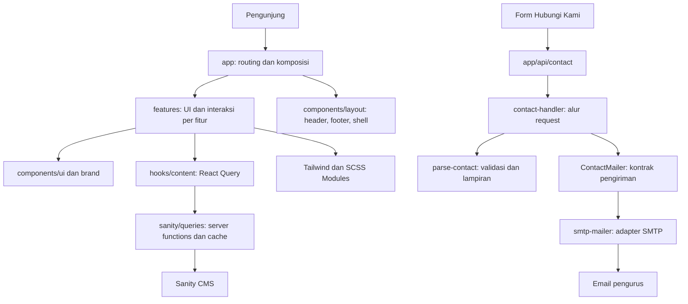

# Website UKM Seni Religi UB

Panduan pengembang untuk periode berikutnya. Stack: Next.js App Router, React,
TypeScript, Sanity, React Query, Tailwind CSS, SCSS Modules, GSAP, dan Nodemailer.
Refactor mempertahankan desain yang sudah disetujui.

## Mulai bekerja

Gunakan Node.js 22.16 atau lebih baru dan npm:

```powershell
npm ci
Copy-Item .env.example .env.local
# Isi konfigurasi Sanity dari pengelola proyek.
npm run dev
```

Website tersedia di `http://localhost:3000`, editor konten di `/studio`.
Produksi: `npm run build`, kemudian `npm start`. Kredensial hanya disimpan di
environment lokal/hosting, bukan Git atau percakapan.

## System design



`app` merangkai fitur dan menetapkan route/metadata. Komponen fitur merender UI;
hooks mengelola state, animasi, atau pengambilan data. Akses CMS dan email
ditempatkan di lapisan layanan. URL publik tetap sama.

## Peta folder

| Folder                   | Tanggung jawab                                                 |
| ------------------------ | -------------------------------------------------------------- |
| `app/`                   | Route, metadata, layout akar, loading/error boundary, endpoint |
| `features/home/`         | Beranda, berita, bidang, prestasi, video, hooks animasi        |
| `features/about/`        | Profil organisasi dan kabinet                                  |
| `features/departments/`  | Detail departemen dan galeri                                   |
| `features/art-fields/`   | Detail bidang seni dan dokumentasi                             |
| `features/activities/`   | Daftar, pratinjau, dan detail berita/acara                     |
| `features/achievements/` | Medali, arsip, filter, dialog prestasi                         |
| `features/contact/`      | Form, FAQ, konfigurasi bersama, layanan email server           |
| `features/gallery/`      | Galeri dan lightbox                                            |
| `features/catalog/`      | Katalog kaligrafi, pagination, skeleton                        |
| `components/layout/`     | Header, footer, skip link, shell publik                        |
| `components/brand/`      | Simbol bidang dan signature partikel bersama                   |
| `components/ui/`         | Primitive UI Radix/shadcn                                      |
| `hooks/content/`         | Hooks React Query untuk CMS                                    |
| `lib/constants/`         | Referensi dan fallback yang masih digunakan                    |
| `lib/query/`             | Factory QueryClient dan kebijakan cache                        |
| `providers/`             | Penyambungan provider di layout                                |
| `sanity/`                | Client, schema, types, query, struktur Studio                  |
| `styles/`                | Token brand dan styling bersama                                |
| `tests/`                 | Kontrak backend, batas arsitektur, acuan styling               |
| `public/`                | Aset statis; dapat dirujuk lewat URL/data CMS                  |

Folder fitur menggunakan bahasa Inggris; route publik tetap bahasa Indonesia.
Komponen memakai PascalCase, file kebab-case, dan hook diawali `use`.
Komponen dan stylesheet lokal diletakkan berdekatan.

## Batas dependensi dan SOLID

- **Single responsibility:** form merender UI, `use-contact-form` mengelola
  state/pengiriman, `parse-contact` memvalidasi, `smtp-mailer` mengirim email.
  Beranda dipecah berdasarkan bagiannya.
- **Open/closed:** provider email baru mengimplementasikan `ContactMailer`
  dan dipasang di route, tanpa mengubah UI.
- **Liskov substitution:** `send(message, id)` selalu mengembalikan
  `Promise<boolean>`. `true` berarti penerima diterima layanan pengiriman,
  bukan jaminan email sudah masuk inbox; adapter menangani kegagalannya.
- **Interface segregation:** handler hanya membutuhkan operasi `send`, bukan
  seluruh API Nodemailer. Topik dan batas lampiran memakai konfigurasi bersama.
- **Dependency inversion:** `createContactHandler(getMailer)` menerima adapter
  dari route. Tes menyuntikkan transport palsu tanpa pengiriman email nyata.

`components` dan `lib` tidak boleh mengimpor `features` atau `app`. Fitur tidak
boleh mengimpor route. UI/hooks browser tidak boleh mengimpor folder `server`.
Gunakan API publik Next.js, bukan `next/dist/...`. Tes arsitektur menegakkan
batas ini. Beranda menggunakan pratinjau milik fitur aktivitas agar dialog berita
tidak diduplikasi.

Satukan kode ketika tanggung jawab dan perilakunya sama. Hindari abstraksi
serbaguna dengan banyak flag hanya untuk menyatukan markup yang sekilas mirip.

## Styling dan animasi

- `app/globals.css`: entry Tailwind v4, theme utility, reset dasar.
- `styles/brand-theme.scss`: token brand, tone section, gelombang.
- `*.module.scss`: layout, pseudo-element, keyframe, dan breakpoint lokal.
- `styles/experience.module.scss`: namespace class bersama. Partial foundation,
  responsive, composition, palette, navigation, dan layout dipisahkan di
  `styles/experience/`. Urutan `@include` mempertahankan cascade desain.
- Gunakan Tailwind untuk utility sederhana dan SCSS Module untuk visual kompleks.
  Inline style tetap digunakan untuk nilai dinamis: koordinat, rasio foto,
  dan custom property tiap kartu.
- Pertahankan wrapper DOM, selector `data-*`, durasi, easing, pin, dan breakpoint
  saat refactor. GSAP menggunakan context/cleanup serta reduced motion.
- Jangan mengandalkan hash class CSS Module. Gunakan import module atau `data-*`.

Tes membandingkan hasil kompilasi 17 stylesheet dengan desain sebelum refactor,
termasuk urutan aturan yang dipertahankan. Stylesheet shell hanya menyisakan
aturan skip-link yang masih digunakan; acuannya diambil dari versi sebelum refactor. Pemeriksaan browser tetap diperlukan untuk data CMS,
font, interaksi, dan animasi. Jangan memperbarui acuan
`tests/fixtures/approved-styles.json` hanya agar tes hijau. Perubahan visual
harus disengaja, ditinjau, dan disetujui terlebih dahulu.

## Data dan cache CMS

Schema menentukan formulir editor, `sanity/types.ts` menentukan kontrak data,
dan `sanity/queries` menentukan projection yang diambil. Fungsi query server
menggunakan `use cache`, `cacheLife`, dan `cacheTag`. Hooks konten menggunakan
stale time bersama. QueryClient dibuat per instance provider agar cache tidak
dibagi antar request server; tidak ada singleton di level module.

Saat menambah field: ubah schema, type, projection, lalu komponen pengguna.
Jangan mengubah ID dokumen, nama `_type`, atau dataset untuk merapikan kode.
Schema yang tidak tampil di website tetap dapat digunakan pengurus di Studio.

## Form Hubungi Kami

`POST /api/contact` mengirim ke **senireligi@ub.ac.id**, dengan maksimal 5
lampiran dan total 3 MB. Penerima ditetapkan server; `Reply-To` adalah email
pengunjung. Lampiran diteruskan, bukan disimpan atau dipublikasikan aplikasi.

Minta konfigurasi pengirim yang diizinkan kepada tim TI kampus. Isi
`CONTACT_SMTP_HOST`, `CONTACT_SMTP_PORT`, `CONTACT_SMTP_USER`,
`CONTACT_SMTP_PASSWORD`, dan `CONTACT_FROM` di environment server. Port 587
menggunakan STARTTLS; port 465 memakai TLS sejak awal. Adapter mendukung
username/password; sesuaikan jika kampus mewajibkan OAuth atau relay internal.
Jangan mematikan validasi sertifikat.

Tanpa konfigurasi, endpoint mengembalikan 503 dan form mempertahankan isian.
Dialog terima kasih hanya muncul setelah pengiriman diterima. Tidak ada `.eml`
atau sukses palsu. Lakukan uji nyata yang disetujui setelah konfigurasi tersedia.

Validasi field/origin/ukuran/ekstensi, honeypot, rate limit, dan deduplikasi
request tersedia. Rate limit dan deduplikasi masih per proses; multi-instance
memerlukan penyimpanan bersama serta rate limit reverse proxy. SMTP tidak
menjamin exactly-once ketika koneksi putus.

## Workflow pengembangan dan pemeriksaan

1. Temukan route di `app`, ikuti import ke folder fiturnya.
2. Pisahkan logika murni ke `lib` lokal fitur, state ke `hooks`, UI ke `components`.
3. Gunakan `SiteLayout` untuk halaman publik. Pertahankan wrapper dan atribut
   tone/wave karena beberapa selector bergantung pada posisi section.
4. Tambahkan tes sukses/gagal untuk aturan backend; jangan kirim email nyata
   dari tes otomatis.
5. Jalankan pemeriksaan dan bandingkan browser desktop/mobile.

```powershell
npm run format        # format source, bukan aset atau backup CMS
npm run check         # lint, TypeScript, tests, pemeriksaan format
npm run build         # verifikasi build produksi
```

Formatter tidak mengurutkan utility Tailwind atau mengganti nilai desain.
ESLint dijalankan tanpa warning yang dibiarkan. Tes menggunakan Node test runner
dan `tsx`; tes email tidak memerlukan kredensial layanan nyata.

Periksa `/`, `/tentang`, `/aktivitas`, `/galeri`, `/prestasi`, `/prestasi/contoh`,
`/kontak`, dan `/katalog` pada desktop 1440×900 serta mobile 430×932. Buka satu
detail aktivitas, bidang, dan departemen. Uji menu, pencarian/filter, carousel,
dialog, Escape, fokus keyboard, serta form/lampiran. Tunggu data dan font selesai
sebelum membandingkan. Animasi dan partikel dapat menghasilkan frame berbeda.

## Serah terima periode berikutnya

Serahkan akses repository, hosting, domain/DNS, Sanity project/dataset, pengelola
SMTP, dan lokasi environment melalui saluran resmi. Catat penanggung jawab DNS
dan kredensial, hasil pemeriksaan, serta bukti tampilan perubahan terakhir.
Backup CMS di `tmp` bukan source code dan tidak diperlukan untuk build.

Komponen eksperimen lama yang tidak terhubung ke route aktif telah dihapus;
versi sebelumnya tetap tersedia di riwayat Git. Aset publik dan dokumen CMS
tidak dihapus dalam refactor.
